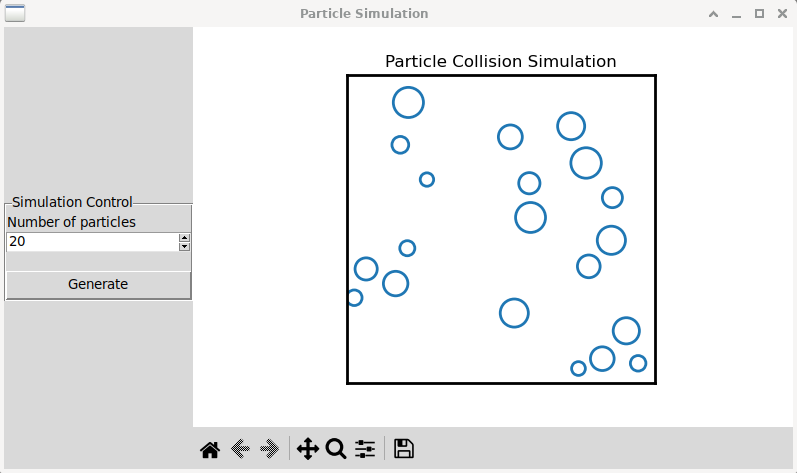

# Particle Collision Simulation GUI

This project implements a graphical particle collision simulation using Python, Tkinter, and Matplotlib. The simulation models hard-circle molecular dynamics, where particles move within a bounded square domain, interact through elastic collisions, and update their positions and velocities over time.

The user can interact with the simulation through a GUI, specifying the number of particles and observing their dynamic behavior in real-time.



### Features

- Simulates particles moving in a 2D square domain.

- Handles particle-particle collisions with conservation of energy and momentum.

- Bounces particles off the walls elastically.

- Real-time rendering of the particle motion using Matplotlib.

- User-friendly GUI to configure the number of particles and restart the simulation.

- Multi-threaded design to ensure the GUI remains responsive during long computations.


### Run

1. Clone the repository
```
git clone https://github.com/westoleaboat/particle-simulation-gui.git
cd particle-simulation-gui
```
2. Create venv
```
python -m venv .venv
source .venv/bin/activate
```
3. Install requirements
```
pip install -r requirements.txt
```
4. Run the simulation
```
python collision.py
```


### Multi-Threading for Responsiveness

The simulation uses a separate thread to perform computations while ensuring GUI updates are thread-safe. A helper function thread_safe_gui_update is provided to schedule updates to Tkinter widgets from non-GUI threads.


### GUI Components

- Input Form: Allows the user to specify the number of particles.

- Simulation Canvas: Displays the particle simulation in real-time.

- Generate Button: Regenerates the simulation with the updated number of particles.


### Future Enhancements

- Add support for user-defined particle radii and velocities.

- Enable saving simulations as video files.

- Include additional interaction forces (e.g., gravitational or electrostatic).